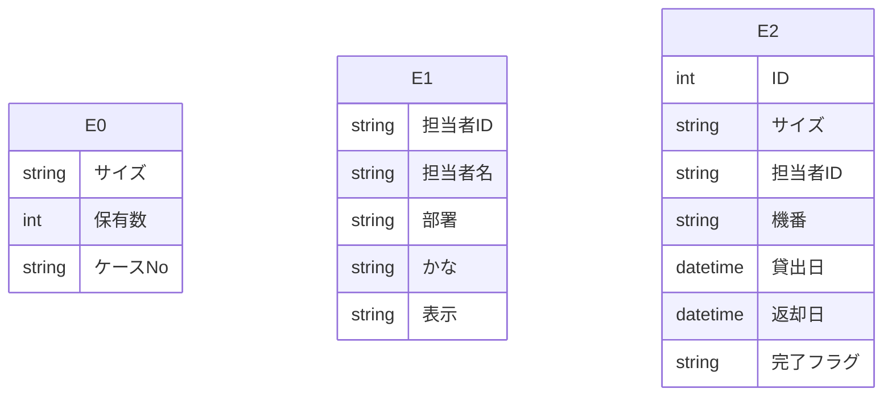

# Access データベース・スキーマ抽出レポート

このファイルは **Access の ODBC メタデータ**から自動生成しました。
LLM に渡す場合は **「スキーマ JSON」セクション**と **「PostgreSQL DDL 草案」**をあわせて指示に含めると、目的の RDB に近い定義を再現しやすくなります。

## LLM / AI 向け: このドキュメントの使い方

以下をプロンプトにコピーして、目的の SQL ダイアレクト（例: PostgreSQL）向け **CREATE TABLE・INDEX・FK** を生成させてください。

```text
あなたはデータベース設計者です。添付 Markdown の次を根拠に、一貫したリレーショナルスキーマを設計してください。
1) YAML フロントマターと「サマリー」の数値
2) 「スキーマ JSON（機械可読・全量）」の tables / relationships / warnings
3) 「PostgreSQL DDL 草案」は参考用。型・NULL・FK・インデックスを JSON・列定義と突き合わせて修正すること。
4) ODBC が SYNONYM としたテーブルはリンク元の実体が別にある場合がある。移行時はデータ取得元を明示すること。
5) relationships が空のときは、列名・サンプルデータから FK を推論してよいが、推論はコメントで区別すること。
出力: (a) 最終 DDL (b) 設計上の想定・未確定事項の箇条書き
```

> ⚠ FK 取得スキップ: t_PGマスタ — ('IM001', '[IM001] [Microsoft][ODBC Driver Manager] ドライバーはこの関数をサポートしていません。 (0) (SQLForeignKeys)')
> ⚠ FK 取得スキップ: t_担当者マスタ — ('IM001', '[IM001] [Microsoft][ODBC Driver Manager] ドライバーはこの関数をサポートしていません。 (0) (SQLForeignKeys)')
> ⚠ FK 取得スキップ: t_貸出 — ('IM001', '[IM001] [Microsoft][ODBC Driver Manager] ドライバーはこの関数をサポートしていません。 (0) (SQLForeignKeys)')

## サマリー

| 項目 | 値 |
|---|---|
| Access ファイル | `\\192.168.1.200\共有\製造課\ピンゲージ管理.accdb` |
| ODBC ドライバ | `Microsoft Access Driver (*.mdb, *.accdb)` |
| テーブル数 | 3 |
| 行数合計（取得できたテーブルのみ） | 33,808 |
| リンクテーブル相当（ODBC: SYNONYM） | 3 |
| 外部キー（検出分） | 0 |
| ビュー / クエリ名 | 0 |
| 警告 | 3 |

## ER 図（Mermaid・参考）

Mermaid 内のエンティティは `E0`, `E1`, … です。実テーブル名は次の対応表を参照してください。

| 記号 | テーブル名 | ODBC 型 | 行数 |
|---|---|---:|---:|
| E0 | `t_PGマスタ` | SYNONYM | 2,026 |
| E1 | `t_担当者マスタ` | SYNONYM | 29 |
| E2 | `t_貸出` | SYNONYM | 31,753 |



## PostgreSQL DDL 草案（全文・自動生成）

```sql
-- PostgreSQL DDL 草案（Access メタデータから自動生成）
-- ※ 型・制約は必ず手動で確認・修正してください

CREATE TABLE "t_PGマスタ" (
    "サイズ" VARCHAR(20),
    "保有数" INTEGER,
    "ケースNo" VARCHAR(5)
);


CREATE TABLE "t_担当者マスタ" (
    "担当者ID" VARCHAR(2),
    "担当者名" VARCHAR(5),
    "部署" VARCHAR(2),
    "かな" VARCHAR(1),
    "表示" VARCHAR(1)
);


CREATE TABLE "t_貸出" (
    "ID" BIGSERIAL,
    "サイズ" VARCHAR(20),
    "担当者ID" VARCHAR(2),
    "機番" VARCHAR(4),
    "貸出日" TIMESTAMP,
    "返却日" TIMESTAMP,
    "完了フラグ" VARCHAR(1)
);
```

## スキーマ JSON（機械可読・全量）

以下をパースすれば、テーブル・列・PK・インデックス・サンプル・統計・FK・ビュー名を一括で渡せます。

```json
{
  "export_spec": "access-inspector/schema-export/v1",
  "generated_at": "2026-05-26T04:20:32.580770+00:00",
  "source": {
    "database_path": "\\\\192.168.1.200\\共有\\製造課\\ピンゲージ管理.accdb",
    "driver_used": "Microsoft Access Driver (*.mdb, *.accdb)"
  },
  "summary": {
    "table_count": 3,
    "sum_row_count_where_known": 33808,
    "tables_with_row_count": 3,
    "linked_table_odbc_synonym_count": 3,
    "relationship_count": 0,
    "view_count": 0,
    "warning_count": 3
  },
  "notes_for_consumer": [
    "ODBC の table_type が SYNONYM のテーブルは Access のリンクテーブルであることが多い。",
    "PostgreSQL 型ヒントは参考。最終 DDL は業務要件とデータ実態で確認すること。",
    "relationships が空でも、命名規則やサンプル行から推定された FK があり得る。"
  ],
  "tables": [
    {
      "name": "t_PGマスタ",
      "table_type": "SYNONYM",
      "row_count": 2026,
      "row_count_error": null,
      "primary_key": [],
      "columns": [
        {
          "name": "サイズ",
          "access_type": "VARCHAR",
          "sql_data_type": -9,
          "column_size": 20,
          "decimal_digits": null,
          "nullable": true,
          "postgres_type_hint": "VARCHAR(20)"
        },
        {
          "name": "保有数",
          "access_type": "INTEGER",
          "sql_data_type": 4,
          "column_size": 10,
          "decimal_digits": 0,
          "nullable": true,
          "postgres_type_hint": "INTEGER"
        },
        {
          "name": "ケースNo",
          "access_type": "VARCHAR",
          "sql_data_type": -9,
          "column_size": 5,
          "decimal_digits": null,
          "nullable": true,
          "postgres_type_hint": "VARCHAR(5)"
        }
      ],
      "indexes": [],
      "sample_headers": [
        "サイズ",
        "保有数",
        "ケースNo"
      ],
      "sample_rows": [
        [
          "0.130",
          1,
          "C01"
        ],
        [
          "0.150",
          1,
          "C01"
        ],
        [
          "0.170",
          1,
          "C01"
        ],
        [
          "0.180",
          1,
          "C01"
        ],
        [
          "0.190",
          1,
          "C01"
        ]
      ],
      "column_stats": [
        {
          "column": "サイズ",
          "null_count": 0,
          "null_rate_pct": 0.0,
          "unique_count": null,
          "unique_rate_pct": null
        },
        {
          "column": "保有数",
          "null_count": 0,
          "null_rate_pct": 0.0,
          "unique_count": null,
          "unique_rate_pct": null
        },
        {
          "column": "ケースNo",
          "null_count": 7,
          "null_rate_pct": 0.3,
          "unique_count": null,
          "unique_rate_pct": null
        }
      ]
    },
    {
      "name": "t_担当者マスタ",
      "table_type": "SYNONYM",
      "row_count": 29,
      "row_count_error": null,
      "primary_key": [],
      "columns": [
        {
          "name": "担当者ID",
          "access_type": "VARCHAR",
          "sql_data_type": -9,
          "column_size": 2,
          "decimal_digits": null,
          "nullable": true,
          "postgres_type_hint": "VARCHAR(2)"
        },
        {
          "name": "担当者名",
          "access_type": "VARCHAR",
          "sql_data_type": -9,
          "column_size": 5,
          "decimal_digits": null,
          "nullable": true,
          "postgres_type_hint": "VARCHAR(5)"
        },
        {
          "name": "部署",
          "access_type": "VARCHAR",
          "sql_data_type": -9,
          "column_size": 2,
          "decimal_digits": null,
          "nullable": true,
          "postgres_type_hint": "VARCHAR(2)"
        },
        {
          "name": "かな",
          "access_type": "VARCHAR",
          "sql_data_type": -9,
          "column_size": 1,
          "decimal_digits": null,
          "nullable": true,
          "postgres_type_hint": "VARCHAR(1)"
        },
        {
          "name": "表示",
          "access_type": "VARCHAR",
          "sql_data_type": -9,
          "column_size": 1,
          "decimal_digits": null,
          "nullable": true,
          "postgres_type_hint": "VARCHAR(1)"
        }
      ],
      "indexes": [],
      "sample_headers": [
        "担当者ID",
        "担当者名",
        "部署",
        "かな",
        "表示"
      ],
      "sample_rows": [
        [
          "01",
          "高田",
          "製造",
          "た",
          "Y"
        ],
        [
          "02",
          "斉藤",
          "製造",
          "さ",
          "Y"
        ],
        [
          "03",
          "加隝",
          "製造",
          "か",
          "Y"
        ],
        [
          "04",
          "今井",
          "製造",
          "い",
          "Y"
        ],
        [
          "05",
          "高橋拓",
          "製造",
          "た",
          "Y"
        ]
      ],
      "column_stats": [
        {
          "column": "担当者ID",
          "null_count": 0,
          "null_rate_pct": 0.0,
          "unique_count": null,
          "unique_rate_pct": null
        },
        {
          "column": "担当者名",
          "null_count": 0,
          "null_rate_pct": 0.0,
          "unique_count": null,
          "unique_rate_pct": null
        },
        {
          "column": "部署",
          "null_count": 0,
          "null_rate_pct": 0.0,
          "unique_count": null,
          "unique_rate_pct": null
        },
        {
          "column": "かな",
          "null_count": 0,
          "null_rate_pct": 0.0,
          "unique_count": null,
          "unique_rate_pct": null
        },
        {
          "column": "表示",
          "null_count": 0,
          "null_rate_pct": 0.0,
          "unique_count": null,
          "unique_rate_pct": null
        }
      ]
    },
    {
      "name": "t_貸出",
      "table_type": "SYNONYM",
      "row_count": 31753,
      "row_count_error": null,
      "primary_key": [],
      "columns": [
        {
          "name": "ID",
          "access_type": "COUNTER",
          "sql_data_type": 4,
          "column_size": 10,
          "decimal_digits": 0,
          "nullable": false,
          "postgres_type_hint": "BIGSERIAL"
        },
        {
          "name": "サイズ",
          "access_type": "VARCHAR",
          "sql_data_type": -9,
          "column_size": 20,
          "decimal_digits": null,
          "nullable": true,
          "postgres_type_hint": "VARCHAR(20)"
        },
        {
          "name": "担当者ID",
          "access_type": "VARCHAR",
          "sql_data_type": -9,
          "column_size": 2,
          "decimal_digits": null,
          "nullable": true,
          "postgres_type_hint": "VARCHAR(2)"
        },
        {
          "name": "機番",
          "access_type": "VARCHAR",
          "sql_data_type": -9,
          "column_size": 4,
          "decimal_digits": null,
          "nullable": true,
          "postgres_type_hint": "VARCHAR(4)"
        },
        {
          "name": "貸出日",
          "access_type": "DATETIME",
          "sql_data_type": 9,
          "column_size": 19,
          "decimal_digits": 0,
          "nullable": true,
          "postgres_type_hint": "TIMESTAMP"
        },
        {
          "name": "返却日",
          "access_type": "DATETIME",
          "sql_data_type": 9,
          "column_size": 19,
          "decimal_digits": 0,
          "nullable": true,
          "postgres_type_hint": "TIMESTAMP"
        },
        {
          "name": "完了フラグ",
          "access_type": "VARCHAR",
          "sql_data_type": -9,
          "column_size": 1,
          "decimal_digits": null,
          "nullable": true,
          "postgres_type_hint": "VARCHAR(1)"
        }
      ],
      "indexes": [],
      "sample_headers": [
        "ID",
        "サイズ",
        "担当者ID",
        "機番",
        "貸出日",
        "返却日",
        "完了フラグ"
      ],
      "sample_rows": [
        [
          58,
          "6.25",
          "05",
          "返-7",
          "2021-06-11T00:00:00",
          "2021-11-15T00:00:00",
          "Y"
        ],
        [
          59,
          "3.11",
          "05",
          "返-7",
          "2021-06-11T00:00:00",
          "2021-11-15T00:00:00",
          "Y"
        ],
        [
          60,
          "4.21",
          "05",
          "返-7",
          "2021-06-11T00:00:00",
          "2021-11-15T00:00:00",
          "Y"
        ],
        [
          80,
          "1.0",
          "10",
          "返-1",
          "2021-06-30T00:00:00",
          "2021-07-09T00:00:00",
          "Y"
        ],
        [
          81,
          "1.3",
          "10",
          "返-1",
          "2021-06-30T00:00:00",
          "2021-07-09T00:00:00",
          "Y"
        ]
      ],
      "column_stats": [
        {
          "column": "ID",
          "null_count": 0,
          "null_rate_pct": 0.0,
          "unique_count": null,
          "unique_rate_pct": null
        },
        {
          "column": "サイズ",
          "null_count": 0,
          "null_rate_pct": 0.0,
          "unique_count": null,
          "unique_rate_pct": null
        },
        {
          "column": "担当者ID",
          "null_count": 0,
          "null_rate_pct": 0.0,
          "unique_count": null,
          "unique_rate_pct": null
        },
        {
          "column": "機番",
          "null_count": 0,
          "null_rate_pct": 0.0,
          "unique_count": null,
          "unique_rate_pct": null
        },
        {
          "column": "貸出日",
          "null_count": 0,
          "null_rate_pct": 0.0,
          "unique_count": null,
          "unique_rate_pct": null
        },
        {
          "column": "返却日",
          "null_count": 405,
          "null_rate_pct": 1.3,
          "unique_count": null,
          "unique_rate_pct": null
        },
        {
          "column": "完了フラグ",
          "null_count": 338,
          "null_rate_pct": 1.1,
          "unique_count": null,
          "unique_rate_pct": null
        }
      ]
    }
  ],
  "relationships": [],
  "views_and_queries": [],
  "vba_modules": [
    {
      "name": "Module1",
      "type": "標準モジュール",
      "line_count": 20
    },
    {
      "name": "Form_f_Main",
      "type": "レポートモジュール",
      "line_count": 302
    },
    {
      "name": "Form_f_Mainのサブフォーム",
      "type": "レポートモジュール",
      "line_count": 14
    },
    {
      "name": "Form_f_Mainのサブフォーム2",
      "type": "レポートモジュール",
      "line_count": 12
    },
    {
      "name": "Form_f_マスタメンテ",
      "type": "レポートモジュール",
      "line_count": 94
    },
    {
      "name": "Form_f_確認",
      "type": "レポートモジュール",
      "line_count": 152
    },
    {
      "name": "Form_f_確認のサブフォーム",
      "type": "レポートモジュール",
      "line_count": 8
    },
    {
      "name": "Form_f_修正",
      "type": "レポートモジュール",
      "line_count": 71
    },
    {
      "name": "Form_f_担当者マスタ",
      "type": "レポートモジュール",
      "line_count": 22
    },
    {
      "name": "Form_f_返却",
      "type": "レポートモジュール",
      "line_count": 186
    },
    {
      "name": "Form_f_返却のサブフォーム",
      "type": "レポートモジュール",
      "line_count": 7
    }
  ],
  "warnings": [
    "FK 取得スキップ: t_PGマスタ — ('IM001', '[IM001] [Microsoft][ODBC Driver Manager] ドライバーはこの関数をサポートしていません。 (0) (SQLForeignKeys)')",
    "FK 取得スキップ: t_担当者マスタ — ('IM001', '[IM001] [Microsoft][ODBC Driver Manager] ドライバーはこの関数をサポートしていません。 (0) (SQLForeignKeys)')",
    "FK 取得スキップ: t_貸出 — ('IM001', '[IM001] [Microsoft][ODBC Driver Manager] ドライバーはこの関数をサポートしていません。 (0) (SQLForeignKeys)')"
  ]
}
```

## テーブル一覧

| テーブル | ODBC 型 | 行数 | PK | インデックス数 |
|---|---|---:|---|---:|
| `t_PGマスタ` | SYNONYM | 2,026 | — | 0 |
| `t_担当者マスタ` | SYNONYM | 29 | — | 0 |
| `t_貸出` | SYNONYM | 31,753 | — | 0 |

## カラム詳細

### `t_PGマスタ`

- **ODBC テーブル種別**: SYNONYM
- **行数**: 2,026

| 列 | Access 型 | PG 型ヒント | sql_data_type | サイズ | 小数 | NULL | PK |
|---|---|---|---:|---:|---:|:---:|:---:|
| サイズ | VARCHAR | VARCHAR(20) | -9 | 20 |  | ○ |  |
| 保有数 | INTEGER | INTEGER | 4 | 10 | 0 | ○ |  |
| ケースNo | VARCHAR | VARCHAR(5) | -9 | 5 |  | ○ |  |

**カラム統計**

| 列 | NULL件数 | NULL率% | ユニーク件数 | ユニーク率% |
|---|---:|---:|---:|---:|
| サイズ | 0 | 0.0 | None | None |
| 保有数 | 0 | 0.0 | None | None |
| ケースNo | 7 | 0.3 | None | None |

**サンプルデータ（先頭数行）**

| サイズ | 保有数 | ケースNo |
|---|---|---|
| 0.130 | 1 | C01 |
| 0.150 | 1 | C01 |
| 0.170 | 1 | C01 |
| 0.180 | 1 | C01 |
| 0.190 | 1 | C01 |

### `t_担当者マスタ`

- **ODBC テーブル種別**: SYNONYM
- **行数**: 29

| 列 | Access 型 | PG 型ヒント | sql_data_type | サイズ | 小数 | NULL | PK |
|---|---|---|---:|---:|---:|:---:|:---:|
| 担当者ID | VARCHAR | VARCHAR(2) | -9 | 2 |  | ○ |  |
| 担当者名 | VARCHAR | VARCHAR(5) | -9 | 5 |  | ○ |  |
| 部署 | VARCHAR | VARCHAR(2) | -9 | 2 |  | ○ |  |
| かな | VARCHAR | VARCHAR(1) | -9 | 1 |  | ○ |  |
| 表示 | VARCHAR | VARCHAR(1) | -9 | 1 |  | ○ |  |

**カラム統計**

| 列 | NULL件数 | NULL率% | ユニーク件数 | ユニーク率% |
|---|---:|---:|---:|---:|
| 担当者ID | 0 | 0.0 | None | None |
| 担当者名 | 0 | 0.0 | None | None |
| 部署 | 0 | 0.0 | None | None |
| かな | 0 | 0.0 | None | None |
| 表示 | 0 | 0.0 | None | None |

**サンプルデータ（先頭数行）**

| 担当者ID | 担当者名 | 部署 | かな | 表示 |
|---|---|---|---|---|
| 01 | 高田 | 製造 | た | Y |
| 02 | 斉藤 | 製造 | さ | Y |
| 03 | 加隝 | 製造 | か | Y |
| 04 | 今井 | 製造 | い | Y |
| 05 | 高橋拓 | 製造 | た | Y |

### `t_貸出`

- **ODBC テーブル種別**: SYNONYM
- **行数**: 31,753

| 列 | Access 型 | PG 型ヒント | sql_data_type | サイズ | 小数 | NULL | PK |
|---|---|---|---:|---:|---:|:---:|:---:|
| ID | COUNTER | BIGSERIAL | 4 | 10 | 0 | × |  |
| サイズ | VARCHAR | VARCHAR(20) | -9 | 20 |  | ○ |  |
| 担当者ID | VARCHAR | VARCHAR(2) | -9 | 2 |  | ○ |  |
| 機番 | VARCHAR | VARCHAR(4) | -9 | 4 |  | ○ |  |
| 貸出日 | DATETIME | TIMESTAMP | 9 | 19 | 0 | ○ |  |
| 返却日 | DATETIME | TIMESTAMP | 9 | 19 | 0 | ○ |  |
| 完了フラグ | VARCHAR | VARCHAR(1) | -9 | 1 |  | ○ |  |

**カラム統計**

| 列 | NULL件数 | NULL率% | ユニーク件数 | ユニーク率% |
|---|---:|---:|---:|---:|
| ID | 0 | 0.0 | None | None |
| サイズ | 0 | 0.0 | None | None |
| 担当者ID | 0 | 0.0 | None | None |
| 機番 | 0 | 0.0 | None | None |
| 貸出日 | 0 | 0.0 | None | None |
| 返却日 | 405 | 1.3 | None | None |
| 完了フラグ | 338 | 1.1 | None | None |

**サンプルデータ（先頭数行）**

| ID | サイズ | 担当者ID | 機番 | 貸出日 | 返却日 | 完了フラグ |
|---|---|---|---|---|---|---|
| 58 | 6.25 | 05 | 返-7 | 2021-06-11T00:00:00 | 2021-11-15T00:00:00 | Y |
| 59 | 3.11 | 05 | 返-7 | 2021-06-11T00:00:00 | 2021-11-15T00:00:00 | Y |
| 60 | 4.21 | 05 | 返-7 | 2021-06-11T00:00:00 | 2021-11-15T00:00:00 | Y |
| 80 | 1.0 | 10 | 返-1 | 2021-06-30T00:00:00 | 2021-07-09T00:00:00 | Y |
| 81 | 1.3 | 10 | 返-1 | 2021-06-30T00:00:00 | 2021-07-09T00:00:00 | Y |

## リレーション（外部キー）

（検出なし、またはドライバが FK メタデータを返しませんでした）

## ビュー / クエリ

（なし）

## VBA モジュール

### `Form_f_Main` （レポートモジュール / 302 行）

```vba
Option Compare Database
Option Explicit

'中止ボタン
Private Sub btnCancel_Click()
    If MsgBox("入力を中止しますか？", vbQuestion + vbYesNo, "確認") = vbYes Then DispInit
    Me.cboKibanA.SetFocus
End Sub

'サブフォームクリアボタン
Private Sub btnClear_Click()
    SubFrmInit
    Me.cboKibanA.SetFocus
End Sub

'返却（画面）ボタン
Private Sub btnHenkyakuOpen_Click()
    DoCmd.OpenForm "f_返却", acNormal
    Me.cboKibanA.SetFocus
End Sub

'確認（画面）ボタン
Private Sub btnKakuninOpen_Click()
    DoCmd.OpenForm "f_確認", acNormal
    Me.cboKibanA.SetFocus
End Sub

'検索ボタン
Private Sub btnKensaku_Click()
    Dim strSQL As String
    
    strSQL = "SELECT t_貸出.ID, t_貸出.サイズ, t_貸出.担当者ID, t_担当者マスタ.担当者名, t_貸出.機番, t_貸出.貸出日, t_PGマスタ.保有数 "
    strSQL = strSQL & "FROM (t_貸出 LEFT JOIN t_担当者マスタ ON t_貸出.担当者ID = t_担当者マスタ.担当者ID) "
    strSQL = strSQL & "LEFT JOIN t_PGマスタ ON t_貸出.サイズ = t_PGマスタ.サイズ "
    If Me.fraKoumoku = 1 Then       'サイズで検索
        If IsNull(Me.txtKensakuSize) Then
            MsgBox "サイズの指定がありません", vbCritical + vbOKOnly, "確認"
            Me.txtKensakuSize.SetFocus
            Exit Sub
        End If
        If Me.chkLike Then          'から始まる
            strSQL = strSQL & "WHERE t_貸出.サイズ LIKE '" & Me.txtKensakuSize & "*' "
        Else
            strSQL = strSQL & "WHERE t_貸出.サイズ = '" & Me.txtKensakuSize & "' "
        End If
    Else
        If IsNull(Me.txtKiban) Then
            MsgBox "機番の指定がありません", vbCritical + vbOKOnly, "確認"
            Me.cboKibanA.SetFocus
            Exit Sub
        End If
        strSQL = strSQL & "WHERE t_貸出.機番 = '" & Me.txtKiban & "' "
    End If
    strSQL = strSQL & "AND t_貸出.完了フラグ IS NULL "
    strSQL = strSQL & "ORDER BY t_貸出.サイズ;"
    Me.f_Mainのサブフォーム.Form.RecordSource = strSQL
    
    Me.Refresh
End Sub

'メンテナンスボタン
Private Sub btnMainte_Click()
    DoCmd.OpenTable "t_貸出", acViewNormal
    Me.cboKibanA.SetFocus
End Sub

'マスタ検索ボタン
Private Sub btnMastKensaku_Click()
    Dim sCrt As String
    
    If IsNull(Me.txtMastSize) Then
        Me.txtMastSize.SetFocus
        Exit Sub
    End If
    
    sCrt = "サイズ = '" & Me.txtMastSize & "'"
    If Not IsNull(DLookup("サイズ", "t_PGマスタ", sCrt)) Then
        Me.f_Mainのサブフォーム2.Form.Recordset.FindFirst sCrt
    Else
        MsgBox "該当するサイズはありません", vbCritical + vbOKOnly, "確認"
    End If
End Sub

'マスタ新規ボタン
Private Sub btnMastNew_Click()
    DoCmd.OpenForm "f_マスタメンテ", , , , , acDialog, "New"
End Sub

'終了ボタン
Private Sub btnQuit_Click()
    DoCmd.Quit
End Sub

'整形ボタン
Private Sub btnSeikei_Click()
    Dim cnn As ADODB.Connection
    Dim rst As ADODB.Recordset
    Dim iPos As Integer
    Dim i As Integer
    Dim sTmp As String
    
    If MsgBox("旧貸出済みゲージの整形を行います。  実行しますか？", vbQuestion + vbYesNo, "確認") <> vbYes Then Exit Sub
    
    Set cnn = CurrentProject.Connection
    Set rst = New ADODB.Recordset
    rst.Open "t_貸出", cnn, adOpenStatic, adLockOptimistic
    
    With rst
        .MoveFirst
        Do While Not .EOF
            If IsNull(.Fields("完了フラグ")) And Len(.Fields("サイズ")) <= 6 Then
                iPos = InStr(.Fields("サイズ"), ".")
                If iPos > 0 Then
                    sTmp = .Fields("サイズ")
                    sTmp = Left(sTmp & "000", iPos + 3)
                    .Fields("サイズ") = sTmp
                    .Update
                    i = i + 1
                End If
            End If
            .MoveNext
        Loop
    End With
    
    rst.Close
    Set rst = Nothing
    Set cnn = Nothing
    
    MsgBox "終了しました：" & CStr(i), vbInformation + vbOKOnly, "確認"
    
End Sub

'担当者マスタボタン
Private Sub btnTantouM_Click()
    DoCmd.OpenForm "f_担当者マスタ", acNormal, , , , acDialog
End Sub

'登録ボタン
Private Sub btnTouroku_Click()
    Dim strSQL As String
    Dim i As Integer
    Dim ErrFlg As Boolean
    Dim CtrlName As String
    Dim iCnt As Integer
    Dim sMsg As String
    
    'エラーチェック
    ErrFlg = False
    If IsNull(Me.txtHizuke) Then ErrFlg = True
    If IsNull(Me.cboKibanA) Then ErrFlg = True
    If Me.cboKibanA <> "数値" And IsNull(Me.cboKibanN) Then ErrFlg = True
    If IsNull(Me.cboTantou) Then ErrFlg = True
    
    iCnt = 0
    For i = 1 To 20
        CtrlName = "txtGauge" & CStr(i)
        If Not IsNull(Controls(CtrlName)) Then iCnt = iCnt + 1
    Next
    If iCnt = 0 Then ErrFlg = True
    
    If ErrFlg Then
        MsgBox "必要項目が入力されていません", vbCritical + vbOKOnly, "確認"
        Me.cboKibanA.SetFocus
        Exit Sub
    End If
    
    '登録
    If MsgBox("登録しますか？", vbQuestion + vbYesNo, "確認") <> vbYes Then
        Me.cboKibanA.SetFocus
        Exit Sub
    End If
    For i = 1 To 20
        CtrlName = "txtGauge" & CStr(i)
        If Not IsNull(Controls(CtrlName)) Then Call InsData(CtrlName)
    Next
    
    strSQL = "SELECT t_貸出.ID, t_貸出.サイズ, t_貸出.担当者ID, t_担当者マスタ.担当者名, t_貸出.機番, t_貸出.貸出日, t_PGマスタ.保有数 "
    strSQL = strSQL & "FROM (t_貸出 LEFT JOIN t_担当者マスタ ON t_貸出.担当者ID = t_担当者マスタ.担当者ID) "
    strSQL = strSQL & "LEFT JOIN t_PGマスタ ON t_貸出.サイズ = t_PGマスタ.サイズ "
    strSQL = strSQL & "WHERE t_貸出.貸出日 = #" & Me.txtHizuke & "# "
    strSQL = strSQL & "AND t_貸出.機番 = '" & Me.txtKiban & "' "
    strSQL = strSQL & "AND t_貸出.担当者ID = '" & Me.cboTantou & "' "
    strSQL = strSQL & "ORDER BY t_貸出.サイズ;"
    Me.f_Mainのサブフォーム.Form.RecordSource = strSQL
    
    DispInit
    Me.Refresh
    Me.cboKibanA.SetFocus
    
    MsgBox "登録しました。内容を確認してください" & vbCrLf & _
           "確認が終わったら「一覧クリア」ボタンをクリックしてください", vbInformation + vbOKOnly, "確認"
End Sub

'機番アルファベットが更新された
Private Sub cboKibanA_AfterUpdate()
    SetKiban
    If Me.cboKibanN.Enabled Then
        Me.cboKibanN.SetFocus
    Else
        Me.cboTantou.SetFocus
    End If
    Me.txtHizuke = Format(Now(), "yyyy/mm/dd")
End Sub

'機番数字が更新された
Private Sub cboKibanN_AfterUpdate()
    SetKiban
    Me.cboTantou.SetFocus
End Sub

'機番をセット
Private Sub SetKiban()
    Dim strSQL As String
    
    strSQL = "SELECT t_担当者マスタ.担当者ID, t_担当者マスタ.担当者名 "
    strSQL = strSQL & "FROM t_担当者マスタ "
    strSQL = strSQL & "WHERE t_担当者マスタ.表示 = 'Y' "
    
    If Me.cboKibanA = "数値" Then
        Me.txtKiban = "数値"
        Me.cboKibanN = Null
        Me.cboKibanN.Enabled = False
        strSQL = strSQL & " And t_担当者マスタ.部署 = '数値' "
    Else
        Me.cboKibanN.Enabled = True
        Me.txtKiban = Me.cboKibanA & "-" & Me.cboKibanN
        If Me.txtKiban = "-" Then Me.txtKiban = Null        '両方なければNull(消された場合に対応)
        strSQL = strSQL & " And t_担当者マスタ.部署 = '製造' "
    End If
    strSQL = strSQL & "ORDER BY t_担当者マスタ.かな;"
    Me.cboTantou.RowSource = strSQL
End Sub

'担当者が更新された
Private Sub cboTantou_AfterUpdate()
    Me.txtGauge1.SetFocus
End Sub

'貸出データ作成
Private Sub InsData(pCtrl As String)
    Dim strSQL As String
    
    DoCmd.SetWarnings False
    
    strSQL = "INSERT INTO t_貸出 ( サイズ, 担当者ID, 機番, 貸出日 "
    strSQL = strSQL & ") VALUES ( "
    strSQL = strSQL & "'" & Controls(pCtrl) & "', "
    strSQL = strSQL & "'" & Me.cboTantou & "', "
    strSQL = strSQL & "'" & Me.txtKiban & "', "
    strSQL = strSQL & "#" & Me.txtHizuke & "# );"
    DoCmd.RunSQL strSQL
    
    DoCmd.SetWarnings True
End Sub

'画面初期化
Private Sub DispInit()
    Dim i As Integer
    Dim CtrlName As String
    
    Me.txtHizuke = Null
    Me.cboKibanA = Null
    Me.cboKibanN = Null
    Me.txtKiban = Null
    Me.cboTantou = Null
    
    For i = 1 To 20
        CtrlName = "txtGauge" & CStr(i)
        Controls(CtrlName) = Null
    Next
End Sub

'サブフォーム初期化
Private Sub SubFrmInit()
    Dim strSQL As String

    strSQL = "SELECT t_貸出.ID, t_貸出.サイズ, t_貸出.担当者ID, t_担当者マスタ.担当者名, t_貸出.機番, t_貸出.貸出日, t_PGマスタ.保有数 "
    strSQL = strSQL & "FROM  (t_貸出 LEFT JOIN t_担当者マスタ ON t_貸出.担当者ID = t_担当者マスタ.担当者ID) "
    strSQL = strSQL & "LEFT JOIN t_PGマスタ ON t_貸出.サイズ = t_PGマスタ.サイズ  "
    strSQL = strSQL & "WHERE t_貸出.サイズ = 'ZZZZZ';"
    Me.f_Mainのサブフォーム.Form.RecordSource = strSQL
End Sub

'フォームを開く時
Private Sub Form_Open(Cancel As Integer)
    Me.f_Mainのサブフォーム.Form.貸出日.ColumnWidth = 567 * 2.4
    Me.f_Mainのサブフォーム.Form.機番.ColumnWidth = 567 * 1.5
    Me.f_Mainのサブフォーム.Form.サイズ.ColumnWidth = 567 * 4
    Me.f_Mainのサブフォーム.Form.担当者名.ColumnWidth = 567 * 2.7
    Me.f_Mainのサブフォーム.Form.ID.ColumnHidden = True
    Me.f_Mainのサブフォーム.Form.担当者ID.ColumnHidden = True
    Me.f_Mainのサブフォーム.Form.保有数.ColumnWidth = 567 * 1.5
    
    SubFrmInit

    Me.f_Mainのサブフォーム2.Form.サイズ.ColumnWidth = 567 * 4
    Me.f_Mainのサブフォーム2.Form.保有数.ColumnWidth = 567 * 1.8
    Me.f_Mainのサブフォーム2.Form.ケースNo.ColumnWidth = 567 * 1.6


End Sub

```

### `Form_f_Mainのサブフォーム` （レポートモジュール / 14 行）

```vba
Option Compare Database
Option Explicit

Private Sub サイズ_Click()
    With GaugeData
        .ID = Me.ID
        .Hizuke = Me.貸出日
        .Kiban = Me.機番
        .TantouCD = Me.担当者ID
        .GaugeSize = Me.サイズ
    End With
    
    DoCmd.OpenForm "f_修正", acNormal, , , , acDialog
End Sub
```

### `Form_f_Mainのサブフォーム2` （レポートモジュール / 12 行）

```vba
Option Compare Database
Option Explicit

'サイズがクリックされた
Private Sub サイズ_Click()
    With MastData
        .sSize = Me.サイズ
        .iSuu = Me.保有数
        .sCaseNo = Nz(Me.ケースNo, "")
    End With
    DoCmd.OpenForm "f_マスタメンテ", , , , , acDialog
End Sub
```

### `Form_f_マスタメンテ` （レポートモジュール / 94 行）

```vba
Option Compare Database
Option Explicit

'閉じるボタン
Private Sub btnClose_Click()
    DoCmd.Close acForm, "f_マスタメンテ"
End Sub

'削除ボタン
Private Sub btnDelete_Click()
    Dim strSQL As String
    
    If MsgBox("このサイズを削除しますか？", vbQuestion + vbYesNo, "確認") <> vbYes Then Exit Sub

    strSQL = "DELETE FROM t_PGマスタ "
    strSQL = strSQL & "WHERE サイズ = '" & Me.txtSize & "';"
    
    DoCmd.SetWarnings False
    DoCmd.RunSQL strSQL
    DoCmd.SetWarnings True
    
    MsgBox "削除しました", vbInformation + vbOKOnly, "確認"
    Forms("f_Main").Refresh
    
    DoCmd.Close acForm, "f_マスタメンテ"
End Sub

'登録ボタン
Private Sub btnTouroku_Click()
    Dim strSQL As String
    
    If IsNull(Me.txtSize) Or IsNull(Me.txtHoyuusuu) Or IsNull(Me.txtCaseNo) Then
        MsgBox "サイズ・保有数・ケースNo は必ず入力してください", vbCritical + vbOKOnly, "確認"
        Exit Sub
    ElseIf IsNumeric(Me.txtSize) And Len(Mid(Me.txtSize, InStr(Me.txtSize, ".") + 1)) <> 3 Then
        If MsgBox("サイズは小数点以下３桁で指定してください。" & _
            vbCrLf & "このまま登録を続けますか", vbCritical + vbYesNo, "確認") <> vbYes Then
            Exit Sub
        End If
    Else
        If MsgBox("登録しますか？", vbQuestion + vbYesNo, "確認") <> vbYes Then Exit Sub
    End If
    
    If Me.txtSize.Enabled Then      '新規登録
        If Not IsNull(DLookup("サイズ", "t_PGマスタ", "サイズ = '" & Me.txtSize & "'")) Then
            MsgBox "このサイズはマスタに登録済みです", vbCritical + vbOKOnly, "確認"
            Exit Sub
        End If
        strSQL = "INSERT INTO t_PGマスタ ( サイズ, 保有数, ケースNo ) VALUES ( "
        strSQL = strSQL & "'" & Me.txtSize & "', "
        strSQL = strSQL & Me.txtHoyuusuu & ", "
        strSQL = strSQL & "'" & Me.txtCaseNo & "');"
    Else
        strSQL = "UPDATE t_PGマスタ SET "
        strSQL = strSQL & "保有数 = " & Me.txtHoyuusuu & ", "
        strSQL = strSQL & "ケースNo = '" & Me.txtCaseNo & "' "
        strSQL = strSQL & "WHERE サイズ = '" & Me.txtSize & "';"
    End If
    
    DoCmd.SetWarnings False
    DoCmd.RunSQL strSQL
    DoCmd.SetWarnings True
    
    MsgBox "登録しました", vbInformation + vbOKOnly, "確認"
    Forms("f_Main").Refresh
    
    DoCmd.Close acForm, "f_マスタメンテ"
End Sub

'フォームを開く時
Private Sub Form_Open(Cancel As Integer)
    If Me.OpenArgs = "New" Then
        Me.btnDelete.Enabled = False
        Me.txtSize.Enabled = True
    Else
        Me.btnDelete.Enabled = True
        Me.txtSize.Enabled = False
        With MastData
            Me.txtSize = .sSize
            Me.txtHoyuusuu = .iSuu
            Me.txtCaseNo = .sCaseNo
        End With
    End If
End Sub

'ケースNoが更新された
Private Sub txtCaseNo_AfterUpdate()
    Me.txtCaseNo = UCase(Me.txtCaseNo)
End Sub

'サイズが更新された
Private Sub txtSize_AfterUpdate()
    Me.txtSize = UCase(Me.txtSize)
End Sub
```

### `Form_f_修正` （レポートモジュール / 71 行）

```vba
Option Compare Database
Option Explicit

'閉じるボタン
Private Sub btnClose_Click()
    DoCmd.Close acForm, "f_修正"
End Sub

'削除ボタン
Private Sub btnSakujo_Click()
    Dim strSQL As String

    If MsgBox("削除しますか？", vbQuestion + vbYesNo, "確認") <> vbYes Then
        Me.txtHizuke.SetFocus
        Exit Sub
    End If
    
    DoCmd.SetWarnings False
    strSQL = "DELETE FROM t_貸出 "
    strSQL = strSQL & "WHERE ID =" & GaugeData.ID & ";"
    DoCmd.RunSQL strSQL
    DoCmd.SetWarnings True
    
    DoCmd.Close acForm, "f_修正"
    Forms("f_Main").Refresh
End Sub

'修正ボタン
Private Sub btnShuusei_Click()
    Dim strSQL As String
    Dim ErrFlg As Boolean
    
    ErrFlg = False
    If IsNull(Me.txtHizuke) Then ErrFlg = True
    If IsNull(Me.txtKiban) Then ErrFlg = True
    If IsNull(Me.cboTantou) Then ErrFlg = True
    If IsNull(Me.txtSize) Then ErrFlg = True
    If ErrFlg Then
        MsgBox "未入力の項目があります。確認してください", vbCritical + vbOKOnly, "確認"
        Me.txtHizuke.SetFocus
        Exit Sub
    End If
    
    If MsgBox("修正しますか？", vbQuestion + vbYesNo, "確認") <> vbYes Then
        Me.txtHizuke.SetFocus
        Exit Sub
    End If
    
    DoCmd.SetWarnings False
    strSQL = "UPDATE t_貸出 SET "
    strSQL = strSQL & "貸出日 = #" & Me.txtHizuke & "#, "
    strSQL = strSQL & "機番 = '" & Me.txtKiban & "', "
    strSQL = strSQL & "担当者ID = '" & Me.cboTantou & "', "
    strSQL = strSQL & "サイズ = '" & Me.txtSize & "' "
    strSQL = strSQL & "WHERE ID =" & GaugeData.ID & ";"
    DoCmd.RunSQL strSQL
    DoCmd.SetWarnings True
    
    DoCmd.Close acForm, "f_修正"
    Forms("f_Main").Refresh
End Sub

'フォームを開く時
Private Sub Form_Open(Cancel As Integer)
    With GaugeData
        Me.txtHizuke = .Hizuke
        Me.txtKiban = .Kiban
        Me.cboTantou = .TantouCD
        Me.txtSize = .GaugeSize
    End With
End Sub
```

### `Form_f_担当者マスタ` （レポートモジュール / 22 行）

```vba
Option Compare Database
Option Explicit

'閉じるボタン
Private Sub btnClose_Click()
    DoCmd.Close acForm, "f_担当者マスタ"
End Sub

'フォームを閉じる時
Private Sub Form_Close()
    Forms("f_Main").Refresh
    Forms("f_Main").cboKibanA.SetFocus
End Sub

'フォームを開く時
Private Sub Form_Open(Cancel As Integer)
    Me.f_担当者マスタのサブフォーム.Form.担当者ID.ColumnWidth = 567 * 2.2
    Me.f_担当者マスタのサブフォーム.Form.担当者名.ColumnWidth = 567 * 3
    Me.f_担当者マスタのサブフォーム.Form.部署.ColumnWidth = 567 * 1.8
    Me.f_担当者マスタのサブフォーム.Form.かな.ColumnWidth = 567 * 1.8
    Me.f_担当者マスタのサブフォーム.Form.表示.ColumnWidth = 567 * 1.8
End Sub
```

### `Form_f_確認` （レポートモジュール / 152 行）

```vba
Option Compare Database
Option Explicit

'中止ボタン
Private Sub btnCancel_Click()
    If MsgBox("中止しますか？", vbQuestion + vbYesNo, "確認") <> vbYes Then
        Me.txtCaseNo.SetFocus
        Exit Sub
    End If
    
    Me.txtCaseNo = Null
    SubFrmInit
    Me.txtID = Null
    Me.txtSize = Null
    Me.txtCaseNo.SetFocus
    Me.Refresh
End Sub

'チェックボタン
Private Sub btnCheck_Click()
    Dim strSQL As String

    strSQL = "SELECT DISTINCT t_貸出.返却日, t_貸出.機番 FROM t_貸出 "
    strSQL = strSQL & "WHERE (t_貸出.完了フラグ Is Null) AND (Not t_貸出.返却日 Is Null);"
    Me.f_確認のサブフォーム2.Form.RecordSource = strSQL
    Me.Refresh
    Me.txtCaseNo.SetFocus
End Sub

'全て確認ボタン
Private Sub btnKakunin_Click()
    Dim strSQL As String

    If MsgBox("確認処理を行いますか？", vbQuestion + vbYesNo, "確認") <> vbYes Then
        Me.txtCaseNo.SetFocus
        Exit Sub
    End If
    
    DoCmd.Echo False
    DoCmd.SetWarnings False
    
    With Me.f_確認のサブフォーム.Form.Recordset
        .MoveFirst
        Do While Not .EOF
            strSQL = "UPDATE t_貸出 SET 完了フラグ = 'Y' "
            strSQL = strSQL & "WHERE ID = " & .Fields("ID") & ";"
            DoCmd.RunSQL strSQL
            .MoveNext
        Loop
        .MoveFirst
    End With
    
    DoCmd.SetWarnings True
    DoCmd.Echo True
    
    SubFrmInit
    Me.txtCaseNo = Null
    Me.txtID = Null
    Me.txtSize = Null
    Me.txtCaseNo.SetFocus
    Me.Refresh
    
    MsgBox "確認しました。", vbInformation + vbOKOnly, "確認"
End Sub

'個別確認ボタン
Private Sub btnKakuninOne_Click()
    Dim strSQL As String

    If IsNull(Me.txtSize) Then
        MsgBox "個別確認サイズの指定がありません", vbCritical + vbOKOnly, "確認"
        Me.txtCaseNo.SetFocus
        Exit Sub
    End If
    
    If MsgBox("個別確認処理を行いますか？", vbQuestion + vbYesNo, "確認") <> vbYes Then
        Me.txtCaseNo.SetFocus
        Exit Sub
    End If
    
    DoCmd.SetWarnings False
    
    strSQL = "UPDATE t_貸出 SET 完了フラグ = 'Y' "
    strSQL = strSQL & "WHERE ID = " & Me.txtID & ";"
    DoCmd.RunSQL strSQL
    
    DoCmd.SetWarnings True
    
    Me.txtID = Null
    Me.txtSize = Null
    Me.txtCaseNo.SetFocus
    Me.Refresh
    
    MsgBox "個別確認しました。", vbInformation + vbOKOnly, "確認"
End Sub

'検索ボタン
Private Sub btnKensaku_Click()
    Dim strSQL As String
    
    strSQL = "SELECT t_貸出.ID, t_貸出.サイズ, t_貸出.担当者ID, t_担当者マスタ.担当者名, t_貸出.機番, t_貸出.貸出日, t_貸出.返却日, "
    strSQL = strSQL & "t_PGマスタ.ケースNo "
    strSQL = strSQL & "FROM (t_貸出 LEFT JOIN t_担当者マスタ ON t_貸出.担当者ID = t_担当者マスタ.担当者ID) "
    strSQL = strSQL & "LEFT JOIN t_PGマスタ ON t_貸出.サイズ = t_PGマスタ.サイズ "
    strSQL = strSQL & "WHERE t_貸出.機番 = '返-" & Me.txtCaseNo & "' "
    strSQL = strSQL & "AND t_貸出.完了フラグ IS NULL;"
    Me.f_確認のサブフォーム.Form.RecordSource = strSQL
    
    Me.txtCaseNo.SetFocus
    Me.Refresh

End Sub

'フォーム開く時
Private Sub Form_Open(Cancel As Integer)
    Dim strSQL As String
    
    Me.f_確認のサブフォーム.Form.サイズ.ColumnWidth = 567 * 4
    Me.f_確認のサブフォーム.Form.担当者名.ColumnWidth = 567 * 2.5
    Me.f_確認のサブフォーム.Form.機番.ColumnWidth = 567 * 2
    Me.f_確認のサブフォーム.Form.返却日.ColumnWidth = 567 * 2.4
    Me.f_確認のサブフォーム.Form.ケースNo.ColumnWidth = 567 * 1.7
    
    Me.f_確認のサブフォーム.Form.ID.ColumnHidden = True
    Me.f_確認のサブフォーム.Form.担当者ID.ColumnHidden = True
    Me.f_確認のサブフォーム.Form.貸出日.ColumnHidden = True
    Me.f_確認のサブフォーム.Form.完了フラグ.ColumnHidden = True

    SubFrmInit
    
    Me.f_確認のサブフォーム2.Form.機番.ColumnWidth = 567 * 2
    Me.f_確認のサブフォーム2.Form.返却日.ColumnWidth = 567 * 2.4
    Me.f_確認のサブフォーム2.Form.完了フラグ.ColumnHidden = True
    strSQL = "SELECT DISTINCT t_貸出.返却日, t_貸出.機番 FROM t_貸出 "
    strSQL = strSQL & "WHERE t_貸出.完了フラグ = 'N';"
    Me.f_確認のサブフォーム2.Form.RecordSource = strSQL

End Sub

'サブフォーム初期化
Private Sub SubFrmInit()
    Dim strSQL As String

    strSQL = "SELECT t_貸出.ID, t_貸出.サイズ, t_貸出.担当者ID, t_担当者マスタ.担当者名, t_貸出.機番, t_貸出.貸出日, t_貸出.返却日, "
    strSQL = strSQL & "t_PGマスタ.ケースNo "
    strSQL = strSQL & "FROM (t_貸出 LEFT JOIN t_担当者マスタ ON t_貸出.担当者ID = t_担当者マスタ.担当者ID) "
    strSQL = strSQL & "LEFT JOIN t_PGマスタ ON t_貸出.サイズ = t_PGマスタ.サイズ "
    strSQL = strSQL & "WHERE t_貸出.サイズ = 'ZZZZZ';"
    Me.f_確認のサブフォーム.Form.RecordSource = strSQL
    Me.Refresh
End Sub

```

### `Form_f_確認のサブフォーム` （レポートモジュール / 8 行）

```vba
Option Compare Database
Option Explicit

'サイズがクリックされた
Private Sub サイズ_Click()
    Forms("f_確認").txtID = Me.ID
    Forms("f_確認").txtSize = Me.サイズ
End Sub
```

### `Form_f_返却` （レポートモジュール / 186 行）

```vba
Option Compare Database
Option Explicit

'中止ボタン
Private Sub btnCancel_Click()
    Call DispInit(True)
    SubFrmInit
    Me.cboKibanA.SetFocus
    Me.Refresh
End Sub

'全て返却ボタン
Private Sub btnHenkyakuAll_Click()
    Dim strSQL As String
    
    If IsNull(Me.txtCaseNo) Then
        MsgBox "返却ケースNoが入力されていません", vbCritical + vbOKOnly, "確認"
        Me.txtCaseNo.SetFocus
        Exit Sub
    End If
    
    If Me.f_返却のサブフォーム.Form.Recordset.RecordCount = 0 Then
        MsgBox "返却の対象品がありません", vbCritical + vbOKOnly, "確認"
        Me.cboKibanA.SetFocus
        Exit Sub
    End If
    
    If MsgBox("全て返却しますか？", vbQuestion + vbYesNo, "確認") <> vbYes Then
        Me.cboKibanA.SetFocus
        Exit Sub
    End If
    
    DoCmd.SetWarnings False
    
    strSQL = "UPDATE t_貸出 SET "
    strSQL = strSQL & "返却日 = #" & Me.txtHizuke & "#, "
    strSQL = strSQL & "機番 = '返-" & Me.txtCaseNo & "' "
    strSQL = strSQL & "WHERE 機番 = '" & Me.txtKiban & "' "
    strSQL = strSQL & "AND 返却日 IS NULL;"
    DoCmd.RunSQL strSQL
    
    DoCmd.SetWarnings True
    
    Call DispInit(True)
    SubFrmInit
    Me.Refresh
    MsgBox "返却処理しました", vbInformation + vbOKOnly, "確認"
End Sub

'個別返却ボタン
Private Sub btnHenkyakuOne_Click()
    Dim strSQL As String

    If IsNull(Me.txtSize) Then
        MsgBox "返却品の指定がありません", vbCritical + vbOKOnly, "確認"
        Me.cboKibanA.SetFocus
        Exit Sub
    End If
    
    If IsNull(Me.txtCaseNo) Then
        MsgBox "返却ケースNoが入力されていません", vbCritical + vbOKOnly, "確認"
        Me.txtCaseNo.SetFocus
        Exit Sub
    End If
    
    If MsgBox("個別返却しますか？", vbQuestion + vbYesNo, "確認") <> vbYes Then
        Me.cboKibanA.SetFocus
        Exit Sub
    End If
    
    DoCmd.SetWarnings False
    
    strSQL = "UPDATE t_貸出 SET "
    strSQL = strSQL & "返却日 = #" & Me.txtHizuke & "#, "
    strSQL = strSQL & "機番 = '返-" & Me.txtCaseNo & "' "
    strSQL = strSQL & "WHERE ID = " & Me.txtID & ";"
    DoCmd.RunSQL strSQL
    
    DoCmd.SetWarnings True
    
    Call DispInit(False)
    Me.Refresh
    Me.cboKibanA.SetFocus
    MsgBox "返却処理しました", vbInformation + vbOKOnly, "確認"
End Sub

'検索ボタン
Private Sub btnKensaku_Click()
    Dim strSQL As String
    
    strSQL = "SELECT t_貸出.ID, t_貸出.サイズ, t_貸出.担当者ID, t_担当者マスタ.担当者名, t_貸出.機番, "
    strSQL = strSQL & "t_貸出.貸出日, t_貸出.返却日, t_PGマスタ.ケースNo "
    strSQL = strSQL & "FROM (t_貸出 LEFT JOIN t_担当者マスタ ON t_貸出.担当者ID = t_担当者マスタ.担当者ID) "
    strSQL = strSQL & "LEFT JOIN t_PGマスタ ON t_貸出.サイズ = t_PGマスタ.サイズ "
    strSQL = strSQL & "WHERE t_貸出.機番 = '" & Me.txtKiban & "' "
    strSQL = strSQL & "AND t_貸出.完了フラグ IS NULL AND t_貸出.返却日 IS NULL "
    strSQL = strSQL & "ORDER BY t_貸出.サイズ;"
    Me.f_返却のサブフォーム.Form.RecordSource = strSQL
    
    Call DispInit(False)
    Me.txtCaseNo.SetFocus
    Me.Refresh
End Sub

'画面初期化
Private Sub DispInit(pMode As Boolean)
    Me.txtSize = Null
    Me.txtID = Null
    If pMode Then
        Me.cboKibanA = Null
        Me.cboKibanN = Null
        Me.txtKiban = Null
        Me.txtHizuke = Null
    End If
End Sub

'機番アルファベットが更新された
Private Sub cboKibanA_AfterUpdate()
    SetKiban
    If Me.cboKibanA = "数値" Then
        Me.btnKensaku.SetFocus
    Else
        Me.cboKibanN.SetFocus
    End If
    Me.txtHizuke = Format(Now(), "yyyy/mm/dd")
End Sub

'機番数字が更新された
Private Sub cboKibanN_AfterUpdate()
    SetKiban
    Me.btnKensaku.SetFocus
End Sub

'機番をセット
Private Sub SetKiban()
    If Me.cboKibanA = "数値" Then
        Me.cboKibanN = Null
        Me.cboKibanN.Enabled = False
        Me.txtKiban = "数値"
        Me.btnHenkyakuAll.Enabled = False
    Else
        Me.txtKiban = Me.cboKibanA & "-" & Me.cboKibanN
        Me.cboKibanN.Enabled = True
        Me.btnHenkyakuAll.Enabled = True
    End If
End Sub

'フォームを開く時
Private Sub Form_Open(Cancel As Integer)
    Me.f_返却のサブフォーム.Form.サイズ.ColumnWidth = 567 * 4
    Me.f_返却のサブフォーム.Form.担当者名.ColumnWidth = 567 * 2.5
    Me.f_返却のサブフォーム.Form.機番.ColumnWidth = 567 * 2
    Me.f_返却のサブフォーム.Form.貸出日.ColumnWidth = 567 * 2.4
    Me.f_返却のサブフォーム.Form.ケースNo.ColumnWidth = 567 * 1.7
    Me.f_返却のサブフォーム.Form.ID.ColumnHidden = True
    Me.f_返却のサブフォーム.Form.担当者ID.ColumnHidden = True
    Me.f_返却のサブフォーム.Form.返却日.ColumnHidden = True

    SubFrmInit
End Sub

'サブフォーム初期化
Private Sub SubFrmInit()
    Dim strSQL As String

    strSQL = "SELECT t_貸出.ID, t_貸出.サイズ, t_貸出.担当者ID, t_担当者マスタ.担当者名, t_貸出.機番, "
    strSQL = strSQL & "t_貸出.貸出日, t_貸出.返却日, t_PGマスタ.ケースNo "
    strSQL = strSQL & "FROM (t_貸出 LEFT JOIN t_担当者マスタ ON t_貸出.担当者ID = t_担当者マスタ.担当者ID) "
    strSQL = strSQL & " LEFT JOIN t_PGマスタ ON t_貸出.サイズ = t_PGマスタ.サイズ "
    strSQL = strSQL & "WHERE t_貸出.サイズ = 'ZZZZZ';"
    Me.f_返却のサブフォーム.Form.RecordSource = strSQL
    Me.Refresh
End Sub

'返却ケースNoが更新された
Private Sub txtCaseNo_AfterUpdate()
    If Len(Me.txtCaseNo) > 2 Then
        MsgBox "返却ケースNoは2桁以内にしてください", vbCritical + vbOKOnly, "確認"
        Me.cboKibanN.SetFocus
        Me.txtCaseNo.SetFocus
        Exit Sub
    End If
        
    If Me.txtKiban <> "数値" Then Me.btnHenkyakuAll.SetFocus
End Sub

```

### `Form_f_返却のサブフォーム` （レポートモジュール / 7 行）

```vba
Option Compare Database
Option Explicit

Private Sub サイズ_Click()
    Forms("f_返却").txtID = Me.ID
    Forms("f_返却").txtSize = Me.サイズ
End Sub
```

### `Module1` （標準モジュール / 20 行）

```vba
Option Compare Database
Option Explicit

Private Type Gauge
    ID As Long
    Hizuke As Variant
    Kiban As String
    TantouCD As String
    GaugeSize As String
End Type

Public GaugeData As Gauge

Private Type Mast
    sSize As String
    iSuu As Integer
    sCaseNo As String
End Type

Public MastData As Mast
```

